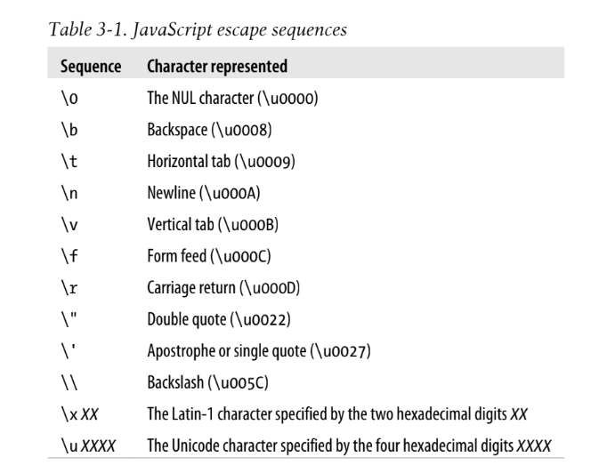

## Text

A string is an immutable ordered sequence of 16-bit values, each of which typically represents a Unicode character—strings are JavaScript’s type for representing text. The length of a string is the number of 16-bit values it contains.

JavaScript’s strings (and its arrays) use zero-based indexing: the first 16-bit value is at position 0, the second at position 1 and so on.

## 1.String Literals

To include a string literally in a JavaScript program, simply enclose the characters of the string within a matched pair of single or double quotes (' or ").

Example :

"" // The empty string: it has zero characters
'testing'
"3.14"
'name="myform"'
"Wouldn't you prefer O'Reilly's book?"
"This string\nhas two lines"
"π is the ratio of a circle's circumference to its diameter"

If you need to include a newline character in a string literal,use the character sequence \n (documented below):

"two\nlines" // A string representing 2 lines written on one line
"one\

## 2. Escape Sequences in String Literals

The backslash character \ has a special purpose in JavaScript strings. Combined with the character that follows it, it represents a character that is not otherwise representable within the string. For example, \n is an escape sequence that represents a newline character.

## 3. Working with Strings

One of the built-in features of JavaScript is the ability to concatenate strings. If you use the + operator with numbers, it adds them.

msg = "Hello, " + "world"; // Produces the string "Hello, world"
greeting = "Welcome to my blog," + " " + name;

Determine the length of a string s like this:

s.length

var s = "hello, world" // Start with some text.\
s.charAt(0) // => "h": the first character.\
s.charAt(s.length-1) // => "d": the last character.\
s.substring(1,4) // => "ell": the 2nd, 3rd and 4th characters.\
s.slice(1,4) // => "ell": same thing\
s.slice(-3) // => "rld": last 3 characters\
s.indexOf("l") // => 2: position of first letter l.\
s.lastIndexOf("l") // => 10: position of last letter l.\
s.indexOf("l", 3) // => 3: position of first "l" at or after 3\

s.split(", ") // => ["hello", "world"] split into substrings\
s.replace("h", "H") // => "Hello, world": replaces all instances\
s.toUpperCase() // => "HELLO, WORLD"\
Remember that strings are immutable in JavaScript. Methods like replace() and\
toUpperCase() return new strings: they do not modify the string on which they are invoked.\

In ECMAScript 5, strings can be treated like read-only arrays, and you can access individual characters (16-bit values) from a string using square brackets instead of the

charAt() method:
s = "hello, world";
s[0] // => "h"

## 4. Pattern Matching

Both strings and RegExp objects have methods for performing pattern matching and search-and-replace operations using regular expressions.

RegExps are not one of the fundamental types of JavaScript. Like Dates, they are simply a specialized kind of object, with a useful API.

For example:
/^HTML/ // Match the letters H T M L at the start of a string \
/[1-9][0-9]*/ // Match a non-zero digit, followed by any # of digits\
/\bjavascript\b/i // Match "javascript" as a word, case-insensitive\

RegExp objects define a number of useful methods, and strings also have methods that accept RegExp arguments. 

For example:
var text = "testing: 1, 2, 3"; // Sample text\
var pattern = /\d+/g // Matches all instances of one or more digits\
pattern.test(text) // => true: a match exists\
text.search(pattern) // => 9: position of first match\
text.match(pattern) // => ["1", "2", "3"]: array of all matches\
text.replace(pattern, "#"); // => "testing: #, #, #" \
text.split(/\D+/); // => ["","1","2","3"]: split on non-digits

