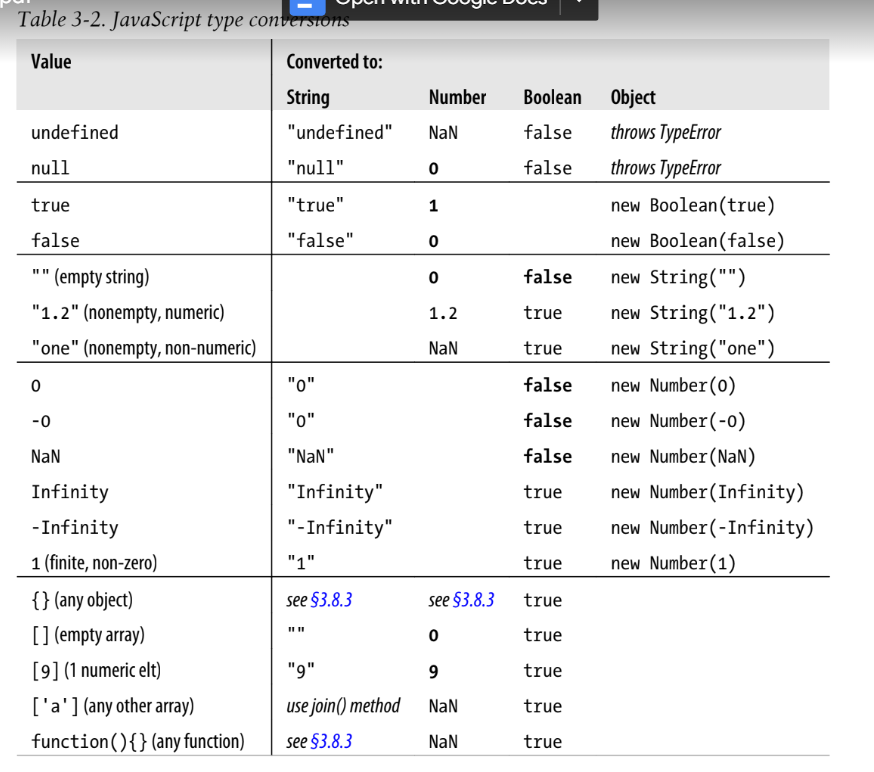

# Type Conversions

We’ve seen this for booleans: when JavaScript expects a boolean value, you may supply a value of any type,
and JavaScript will convert it as needed. Some values (“truthy” values) convert to true and others (“falsy” values) convert to false. 

The same is true for other types: if JavaScript wants a string, it will convert whatever value you give it to a string. If Java-
Script wants a number, it will try to convert the value you give it to a number

Ex :

10 + " objects" // => "10 objects". Number 10 converts to a string
"7" * "4" // => 28: both strings convert to numbers

## Conversions and Equality

JavaScript can convert values flexibly, its == equality operator is also flexible with its notion of equality.

null == undefined // These two values are treated as equal.

"0" == 0 // String converts to a number before comparing.

0 == false // Boolean converts to number before comparing.

"0" == false // Both operands convert to numbers before comparing.

* The  **if** statement converts **undefined** to **false**, but the **==** operator never attempts to convert its operands to booleans.

## Explicit Conversions

The simplest way to perform an explicit type conversion is to use the Boolean(),Number(),String(), or Object() functions.

Number("3") // => 3

String(false) // => "false" Or use false.toString()

Boolean([]) // => true

Object(3) // => new Number(3)

When working with financial or scientific data, you may want to convert numbers to strings in ways that give you control over the number of decimal places or the number of significant digits in the output, or you may want to control whether exponential notation is used. The

var n = 123456.789;

n.toFixed(0); // "123457"

n.toFixed(2); // "123456.79"

n.toFixed(5); // "123456.78900"

n.toExponential(1); // "1.2e+5"

n.toExponential(3); // "1.235e+5"

n.toPrecision(4); // "1.235e+5"

n.toPrecision(7); // "123456.8"

n.toPrecision(10); // "123456.7890"

* parseInt() parses only integers, while parseFloat() parses both integers
and floating-point numbers.

parseInt("3 blind mice") // => 3

parseFloat(" 3.14 meters") // => 3.14

parseInt("-12.34") // => -12

parseInt("0xFF") // => 255
parseInt("0xff") // => 255
parseInt("-0XFF") // => -255
parseFloat(".1") // => 0.1
parseInt("0.1") // => 0
parseInt(".1") // => NaN: integers can't start with "."
parseFloat("$72.47$"); // => NaN: numbers can't start with "$"

## Object to Primitive Conversions

Object-to-boolean conversions are trivial: all objects (including arrays and functions) convert to true. This is so even for wrapper objects: new Boolean(false) is an object rather than a primitive value, and so it converts to true.

This is complicated by the fact that JavaScript objects have two different methods that perform conversions, and it is also complicated by
some special cases described below.

All objects inherit two conversion methods.

The first is called toString(), and its job is to return a string representation of the object.

({x:1, y:2}).toString() // => "[object Object]"

The other object conversion function is called valueOf(). The job of this method is less well-defined: it is supposed to convert an object to a primitive value that represents the object, if any such primitive value exists.

var d = new Date(2010, 0, 1); // January 1st, 2010, (Pacific time)
d.valueOf() // => 1262332800000

To convert an object to a string, JavaScript takes these steps:

* If the object has a toString() method, JavaScript calls it. If it returns a primitive value, JavaScript converts that value to a string (if it is not already a string) and returns the result of that conversion. Note that primitive-to-string conversions are all well-defined in Table 3-2.

* If the object has no toString() method, or if that method does not return a primitive value, then JavaScript looks for a valueOf() method. If the method exists, JavaScript calls it. If the return value is a primitive, JavaScript converts that value to a string (if it is not already) and returns the converted value.

* Otherwise, JavaScript cannot obtain a primitive value from either toString() or
valueOf(), so it throws a TypeError

To convert an object to a number, JavaScript does the same thing, but it tries the
valueOf() method first:

* If the object has a valueOf() method that returns a primitive value, JavaScript con-
verts (if necessary) that primitive value to a number and returns the result.

* Otherwise, if the object has a toString() method that returns a primitive value,
JavaScript converts and returns the value.
* Otherwise, JavaScript throws a TypeError.

